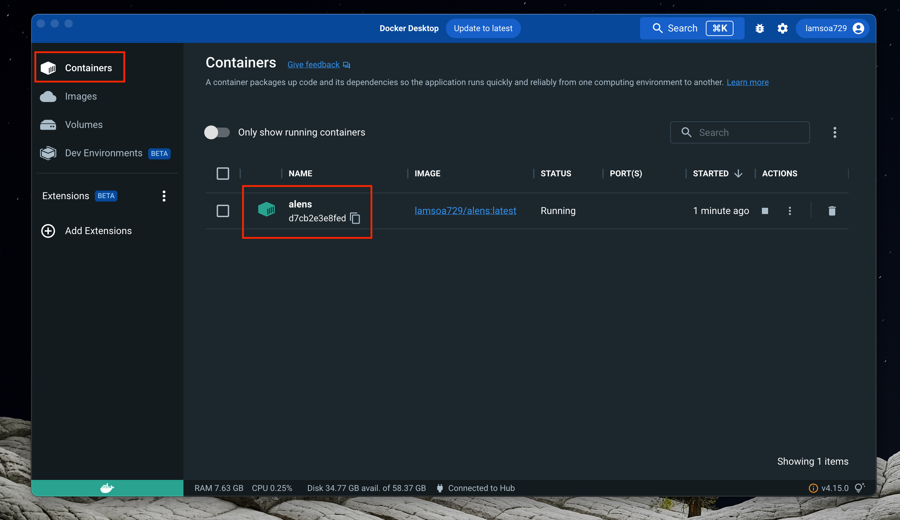
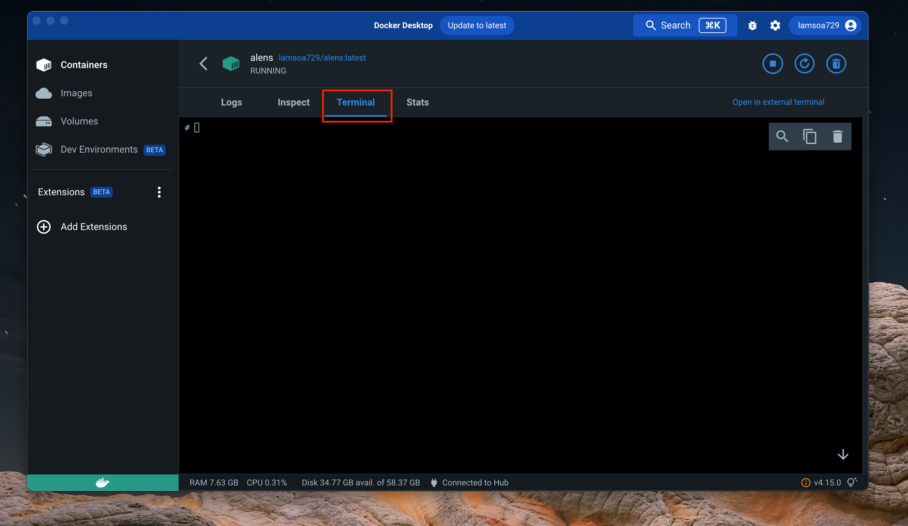

(quickstart)=
# aLENS quickstart

This a _gentle_ introduction to running aLENS on a local computer using docker.

## Pre-software installation

- Docker desktop
  - Sign up at docker hub [https://hub.docker.com/](https://hub.docker.com/)
  - Download docker desktop [https://www.docker.com/products/docker-desktop/](https://www.docker.com/products/docker-desktop/)
  - (Optional) Docker engine
    - Linux [https://www.linux.com/topic/desktop/how-install-and-use-docker-linux/](https://www.linux.com/topic/desktop/how-install-and-use-docker-linux/)
    - Mac [https://medium.com/crowdbotics/a-complete-one-by-one-guide-to-install-docker-on-your-mac-os-using-homebrew-e818eb4cfc3](https://medium.com/crowdbotics/a-complete-one-by-one-guide-to-install-docker-on-your-mac-os-using-homebrew-e818eb4cfc3)
- paraview [https://www.paraview.org/download/](https://www.paraview.org/download/)
- hdf5 view
  - Sign up for service [https://www.hdfgroup.org/register/](https://www.hdfgroup.org/register/)
  - Download at [https://www.hdfgroup.org/downloads/hdfview/#download](https://www.hdfgroup.org/downloads/hdfview/#download)

## Creating a container

<!-- 1. Open [docker desktop](https://www.docker.com/blog/getting-started-with-docker-desktop/) -->

<!-- TODO Make overview for dockerhub image -->
1. Pull latest docker image from [dockerhub](https://hub.docker.com/r/lamsoa729/alens)

   ```bash
   docker pull lamsoa729/alens:latest
   ```

1. Make a folder to access your simulation data stored generated in docker container

   ```bash
   mkdir my_alens_data; cd my_alens_data
   ```

1. Create and run a docker container from the image pulled from dockerhub
   ```bash
   docker run --volume=<path/to/my_alens_data>:/root/Run --name alens -dit lamsoa729/alens:latest
   ```
    replacing `<path/to/my_alens_data>` with the path to the directory made in the previous step. For completeness, here are the descriptions of the used options:
    * `--volume`: option mounts the containers `/root/Run` directory to your local machines `<path/to/my_alens_data>` folder so you can interact with data from your local machine. This is useful for playing with visualizations and post-processing of data without increasing the size or memory usage of the container. 
    * `--name`: Gives the container a name to easily identify what the container is for and access its command line later interface (CLI) later. 
    * `-dit`:  Combined shorthand options of `--detach`, `--interactive`, and `--tty`. This essentially runs the container perpetually in the background until you manually stop it. While it is running, you can interact with it through a terminal -- originally called a TeleTYpe (TTY) for historical reasons.

You now have access to an environment that can run aLENS but will create data files on your local computer.

## Running aLENS inside docker containter

1.  To open a CLI with your docker container, you can either use your native terminal or docker desktop's GUI. 
 
    * For native terminal
  
      ```bash
      docker exec -it alens /bin/bash
      ```
    * For docker desktop, click the running `alens` container while in the containers section
      
      then click the `terminal` tab in the upper middle of the window 
      
    
    You may treat this CLI just like any terminal that is connected to a remote server. 

4.  From this CLI, navigate to the `Run` directory
    ```bash
    cd /root/Run 
    ```

5.  While still in the CLI, copy the example configuration to the data folder

    ```bash
    cp -r ~/aLENS/Examples/MixMotorSliding .
    cd MixMotorSliding
    ```

6.  Copy the contents of the `Run` template directory from aLENS to the data folder as well

    ```bash
    cp -r ~/aLENS/Run/* .
    ```

    You should now see an `aLENS.X` executable in this directory along with `result` and `script` directories containing useful scripts for processing, storing, and cleaning up generated files.

7.  Run _aLENS_

    ```bash
    ./aLENS.X
    # or to control the number of cores used
    OMP_NUM_THREADS=<number_of_cores> ./aLENS.
    ```

8.  Stop the run by pressing `[ctrl+c]`
9.  Execute run again as we did in step 4. Notice that the aLENS simulation continues from the last snapshot. This is a very useful restart feature for longer runs.

## Parameter and initial configuration files

The executable `aLENS.X` reads 2 input files (4 if specifying starting object configurations):

- `RunConfig.yaml` specifies simulation parameters for the system and rod-like objects (sylinders).
- `ProteinConfig.yaml` specifies types and parameter of crosslinking and motor objects (proteins).
- `TubuleInitial.dat` specifies initial configuration of sylinders (optional).
- `ProteinInitial.dat` specifies initial configuration of proteins (optional).

### Example parameter config files

`RunConfig.yaml`:

```yaml
#Example of system and sylinder configuration file
conMaxIte: 10000
conResTol: 1e-5
conSolverChoice: 0
logLevel: 3
monolayer: false
rngSeed: 1234
simBoxHigh:
  - 20.0
  - 1.0
  - 1.0
simBoxLow:
  - 0.0
  - 0.0
  - 0.0
simBoxPBC:
  - false
  - false
  - false
sylinderColBuf: 1.0
sylinderDiameter: 0.025
sylinderDiameterColRatio: 1.0
sylinderFixed: false
sylinderLength: 0.5
sylinderLengthColRatio: 1.0
sylinderLengthSigma: 0
sylinderNumber: 4000
dt: 1.0e-05
timeSnap: 0.01
timeTotal: 10.0
timerLevel: 3
viscosity: 1.0
```

`ProteinConfig.yaml`:

```yaml
#Example of crosslinker and motor configuration file
KBT: 0.00411 # pN.um, at 300K
proteins:
    - tag: 0 # Type 0, active Kinesin-1
    #properties:
    walkOff: true
    PtoAPratio: 1.0
    fixedEnd0: true
    freeLength: 0.05 # um
    rc: 0.038 # um ( freeLength/2 + D/2 )
    kappa: 100 # pN/um
    fstall: 7.0 # pN
    lambda: 0.5 # dimensionless, energy dependent unbinding
    vmax: [0, 1.0] # um/s
    diffUnbound: 1.0 # 0.436 um^2/s when viscosity=0.02
    diffBoundS: [0.0, 1.0e-2] # um^2/s
    diffBoundD: [0.0, 1.0e-2] # um^2/s
    # KMC parameters
    useBindVol: false
    lookupType: 1
    lookupGrid: 2048
    eps: 400 # um^{-1}
    Ka: [0, 10.0] # (uM)^{-1}
    ko_s: [0, 1.0] # 1/s or [0.3, 10.0]
    Ke: [0, 10.0] # (uM)^{-1}
    ko_d: [0, 1.0] # 1/s or [0.3, 10.0]
    #numbers:
    freeNumber: 0
    fixedLocationPerMT: [2, 2, 2, 2, 2, 2, 2, 2, 2, 2, 2, 2, 2, 2, 2, 2, 2, 2, 2, 2, 2, 2, 2, 2, 2, 2, 2, 2, 2, 2, 2, 2, 2, 2, 2, 2, 2, 2, 2, 2, 2, 2, 2, 2, 2, 2, 2, 2, 2, 2, 2, 2, 2, 2, 2, 2, 2, 2, 2, 2, 2, 2, 2, 2, 2, 2, 2, 2, 2, 2, 2, 2, 2, 2, 2, 2, 2, 2, 2, 2] # 80
    - tag: 1 # Type 0, passive Kinesin-1
    #properties:
    walkOff: true
    PtoAPratio: 1.0
    fixedEnd0: true
    freeLength: 0.05 # um
    rc: 0.038 # um ( freeLength/2 + D/2 )
    kappa: 100 # pN/um
    fstall: 7.0 # pN
    lambda: 0.5 # dimensionless, energy dependent unbinding
    vmax: [0, 0.0] # um/s
    diffUnbound: 1.0 # 0.436 um^2/s when viscosity=0.02
    diffBoundS: [0.0, 0.0] # um^2/s
    diffBoundD: [0.0, 0.0] # um^2/s
    # KMC parameters
    useBindVol: false
    lookupType: 1
    lookupGrid: 2048
    eps: 400 # um^{-1}
    Ka: [0, 10.0] # (uM)^{-1}
    ko_s: [0, 0.1] # 1/s or [0.3, 10.0]
    Ke: [0, 10.0] # (uM)^{-1}
    ko_d: [0, 0.1] # 1/s or [0.3, 10.0]
    #numbers:
    freeNumber: 0
    fixedLocationPerMT: [2, 2, 2, 2, 2, 2, 2, 2, 2, 2, 2, 2, 2, 2, 2, 2, 2, 2, 2, 2] # 20
```

---

**NOTE:**
All default values and further explanation of parameters can be found in
`SimToolbox/Sylinder/SylinderConfig.hpp` and `Protein/ProteinConfig.hpp` files
in the `aLENS` gitrepo.

---

(initial_files)=
### Initial configuration file lines (optional)

`TubuleInitial.dat`

First two lines: Number of sylinders, time step. (These do not get read for initial conditions.)
| | Sylinder type | Global ID | Radius | Minus end x-pos | Minus end y-pos | Minus end z-pos | Plus end x-pos | Plus end y-pos | Plus end z-pos | Group |
| ------------ | ------------------------------------------ | --------- | ------ | --------------- | --------------- | --------------- | -------------- | -------------- | -------------- | ----- |
| **Option/parameter type** | ‘C’ for regular cylinder or ‘S’ stationary | int | float | float | float | float | float | float | float | int |
| **Example line** | C | 0 | .0125 | 0 | 0.5 | 0.57 | 20 | 0.5 | 0.57 | -1 |

`ProteinInitial.dat`

First two lines: Number of proteins, time step. (These do not get read for initial condition.)
| Name | Protein character | Global ID | Protein tag | End 0 x-pos | End 0 y-pos | End 0 z-pos | End 1 x-pos | End 1 y-pos | End 1 z-pos | End 0 bind ID | End 1 bind ID |
| ------------ | ----------------- | --------- | ----------- | ----------- | ----------- | ----------- | ----------- | ----------- | ----------- | --------------------- | --------------------- |
| **Option/parameter type** | ‘P’ | int | int | float | float | float | float | float | float | int (-1 if not bound) | int (-1 if not bound) |
| **Example line** | P | 41 | 0 | 8.85976 | 0.5 | 0.5 | 8.85976 | 0.5 | 0.5 | -1 | 2 |

---

**NOTE:**
For example initial configuration files, navigate to `Examples/MixMotorSliding/TubuleInitial.dat` and `Examples/MixMotorSliding/ProteinInitial.dat`. If no configuration files are present in the directory `aLENS.X` is run, objects will be generated according to the parameters in `RunConfig.yaml` and `ProteinConfig.yaml`.

---

<!--## Visualizing-->

<!--1. Collect metadata using the given python script-->
<!--1. Start paraview-->
<!--1. Load state file-->
<!--1. Point paraview to the correct files-->
<!--1. Visualize-->
<!--1. Change color of crosslinkers-->

<!--## Create images for animation-->

<!--1. Create PNG folder-->
<!--1. Start from beginning and save animation pointing to the PNG folder-->
<!--1. Run the creation of the data-->

<!--## Post-processing with alens_analysis-->

<!--- Clone alens_analysis on local machine-->

<!--    ```bash-->
<!--    git clone --recursive https://github.com/flatironinstitute/aLENS_analysis.git-->
<!--    ccd aLENS_analysis-->
<!--    ```-->

<!--- Create a virtual environment-->
<!--    - Install `conda install numpy h5py scipy matplotlib vtk pyyaml numba`-->

<!--```bash-->
<!--conda create env -f environment.yml-->
<!--#or-->
<!--python3 -m venv /path/to/new/virtual/environment-->
<!--source my_venv/bin/activate-->
<!--pip install numpy h5py scipy matplotlib vtk pyyaml numba-->
<!--# Then-->
<!--pip install -e . -->
<!--```-->

<!--- Install all the requirements for alens_analysis-->
<!--- Run collection code-->
<!--- Look at data using hdf5 view-->

<!--## Installing on workstation-->

<!--- Cloning the repository-->

<!--[Installing aLENS from scratch](https://www.notion.so/Installing-aLENS-from-scratch-d2b0e413543b4c3e89ed7a2e7fac37b7)-->

<!--- Full compiling on workstation-->
<!--- Setting up environment-->
<!--- Make a `setEnvironment.sh` file-->

<!--## Future topics-->

<!--- General structure of aLENS framework-->
<!--- [ ]  What are the basics steps of the code-->
<!--- Mounting your data on your home computer-->
<!--- [ ]  How to set up fuse and quick commands-->
<!--- Generating movies-->
<!--- [ ]  How to use the script I’ve made for this-->
<!--- How to manage data-->
<!--- [ ]  Go over the ceph file system and why keeping the file number small is a necessary-->
<!--- [ ]  Zipping files-->
<!--- [ ]  Accessing them through an archive-->
<!--- Generating files with my current python scripts-->
<!--- [ ]  Move those scripts to either aLENS or aLENS_analysis-->
<!--- [ ]  Maybe introduce people to chi-pet?-->
<!--- Using slurm submit files-->
<!--- [ ]  Try one of these out myself-->
<!--- [ ]  Create a heuristic  for choosing the right number of cores and other system parameters-->
<!--- [ ]  Go over other things that slow down your simulations. (I/O processes)-->
<!--- Tuning parameters properly for best results-->
<!--- [ ]  Check to make sure that you are not missing any that are currently in the code-->

<!--- `SylinderConfig.hpp`-->
<!--Physical and simulation parameters for rod-like objects are defined in the `SimToolbox/Sylinder/SylinderConfig.hpp` file.-->
<!--Some parameters have default values and need not be defined in the config files.-->

<!--```cpp-->
<!--unsigned int rngSeed; ///< random number seed-->
<!--int logLevel;         ///< follows SPDLOG level enum, see Util/Logger.hpp for details-->
<!--int timerLevel = 0;   ///< how detailed the timer should be-->

<!--// domain setting-->
<!--double simBoxHigh[3];   ///< simulation box size-->
<!--double simBoxLow[3];    ///< simulation box size-->
<!--bool simBoxPBC[3];      ///< flag of true/false of periodic in that direction-->
<!--bool monolayer = false; ///< flag for simulating monolayer on x-y plane-->

<!--double initBoxHigh[3];      ///< initialize sylinders within this box-->
<!--double initBoxLow[3];       ///< initialize sylinders within this box-->
<!--double initOrient[3];       ///< initial orientation for each sylinder. >1 <-1 means random-->
<!--bool initCircularX = false; ///< set the initial cross-section as a circle in the yz-plane-->
<!--int initPreSteps = 100; ///< number of initial pre steps to resolve potential collisions-->

<!--// physical constant-->
<!--double viscosity; ///< unit pN/(um^2 s), water ~ 0.0009-->
<!--double KBT;       ///< pN.um, 0.00411 at 300K-->
<!--double linkKappa; ///< pN/um stiffness of sylinder links-->
<!--double linkGap;   ///< um length of gap between sylinder links-->

<!--// sylinder settings-->
<!--bool sylinderFixed = false; ///< sylinders do not move-->
<!--int sylinderNumber;         ///< initial number of sylinders-->
<!--double sylinderLength;      ///< sylinder length (mean if sigma>0)-->
<!--double sylinderLengthSigma; ///< sylinder length lognormal distribution sigma-->
<!--double sylinderDiameter;    ///< sylinder diameter-->

<!--// collision radius and diameter-->
<!--double sylinderDiameterColRatio; ///< collision diameter = ratio * real diameter-->
<!--double sylinderLengthColRatio;   ///< collision length = ratio * real length-->
<!--double sylinderColBuf;           ///< threshold for recording possible collision-->

<!--// time stepping-->
<!--double dt;        ///< timestep size-->
<!--double timeTotal; ///< total simulation time-->
<!--double timeSnap;  ///< snapshot time. save one group of data for each snapshot-->

<!--// constraint solver-->
<!--double conResTol;    ///< constraint solver residual-->
<!--int conMaxIte;       ///< constraint solver maximum iteration-->
<!--int conSolverChoice; ///< choose a iterative solver. 0 for BBPGD, 1 for APGD, etc-->
<!--```-->

<!--- `ProteinConfig.cpp`-->
<!--Physical and simulation parameters for rod-like objects are defined in the `SimToolbox/Sylinder/SylinderConfig.hpp` file.-->

<!--```cpp-->
<!--// per protein properties-->
<!--int tag = 0;              ///< user-assigned integer tag for different types-->
<!--bool walkOff = true;      ///< walf off the end, i.e., no 'end-dewelling'-->
<!--double fixedLocation = 0; ///< in [-1,1]-->
<!--double freeLength = 0.05; ///< the free length. unit um-->
<!--double kappa = 204.7; ///< Spring constant when attached to MT. unit pN/um-->
<!--double fstall = 1.0;  ///< stall force. unit pN-->
<!--double diffUnbound = 4.5; ///< Unbounded diffusivity, unit um^2/s-->
<!--double lambda = 0;        ///< dimensionless unbinding load sensitivity-->

<!--double PtoAPratio = 1.; ///< Parallel to anti-parallel binding ratio-->
<!--bool fixedEnd0 = false; ///< end0 is fixed to a MT at the given location-->
<!--bool useBindVol = false;-->
<!--///< Calculate KMC_s_d factor using effective volume unbound exists in-->

<!--// per head properties-->
<!--bool vdrag[2] = {false, false}; ///< if including dragged motion-->
<!--double vmax[2] = {0, 0};        ///< max velocity for each end.  um/s-->
<!--double vmaxAP[2] = {0, 0};-->
<!--///< max velocity for each end, anti parallel. um/s-->

<!--double diffBoundS[2] = {0, 0};-->
<!--///< diffusivity for ends when singly bound. unit um^2/s-->
<!--double diffBoundD[2] = {0, 0};-->
<!--///< diffusivity for ends when doubly bound. unit um^2/s-->

<!--// kMC data field-->
<!--double rc;  ///< the capture radius of protein (user set)-->
<!--double eps; ///< Number of crosslinker binding sites per um of MT-->
<!--double ko_s[2];-->
<!--///< Turnover rate for each end for KMC_u_s and KMC_s_u steps-->
<!--double ko_d[2];-->
<!--///< Turnover rate for each end for KMC_s_d and KMC_d_s steps-->
<!--double Ka[2];-->
<!--///< Association constant when neither head is bound-->
<!--double Ke[2];-->
<!--///< Equilibrium constant when other end is bound-->

<!--///< The type of potential to use when using the binding lookup table-->
<!--///<    0: U = k/2 * (sqrt(d^2 + s^2) - ell0 - D)^2-->
<!--///<    1: U = k/2 * ((d-D)*sqrt(1 +  (s/d)^2) - ell0)^2-->
<!--///< d: perpendicular distance to potentially bound filament-->
<!--///< s: parallel distance along filament from closest point-->
<!--int lookupType = 0;-->
<!--int lookupGrid = 256;-->
<!--```-->
