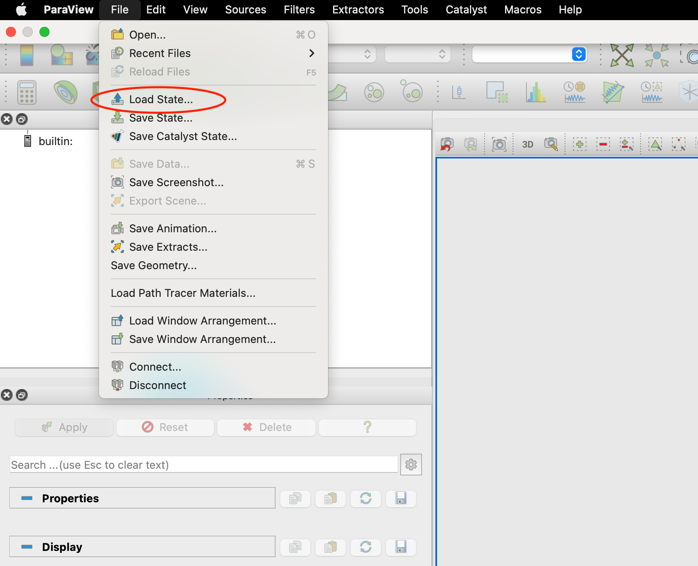
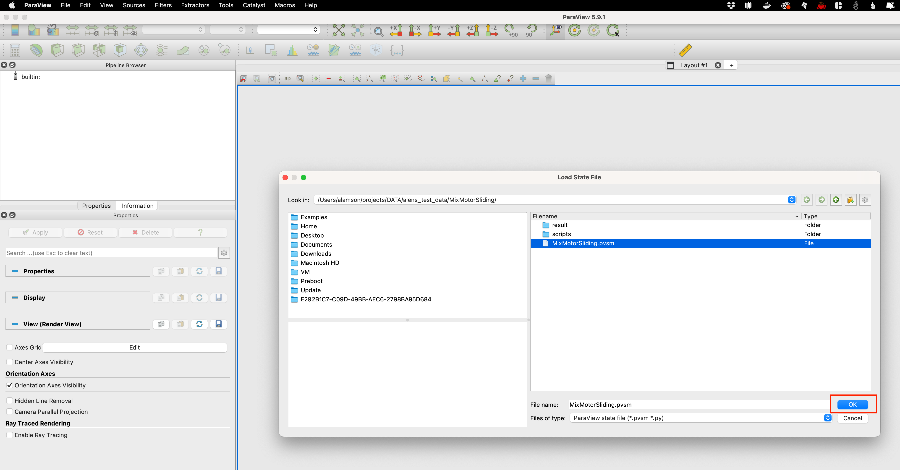
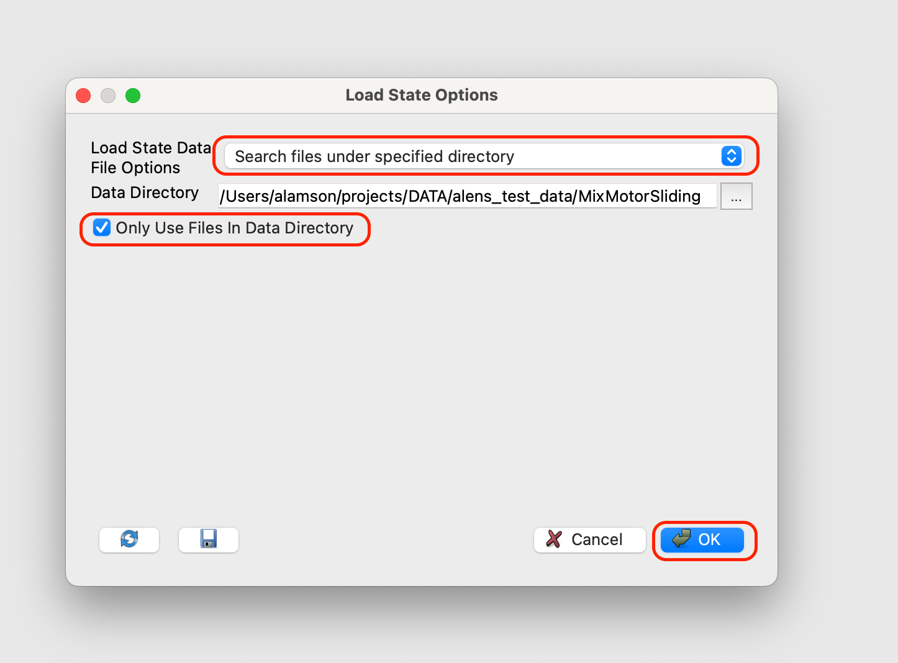
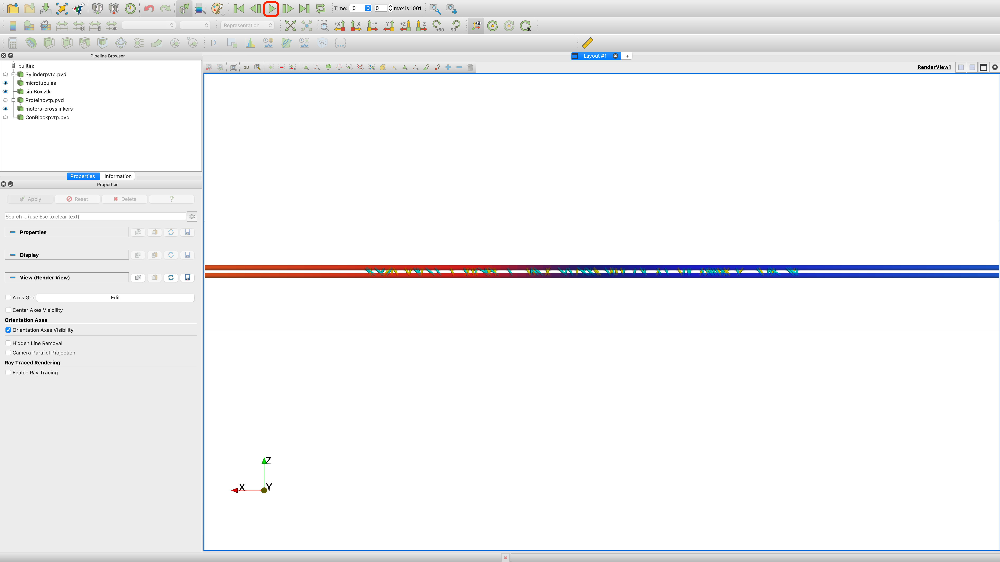
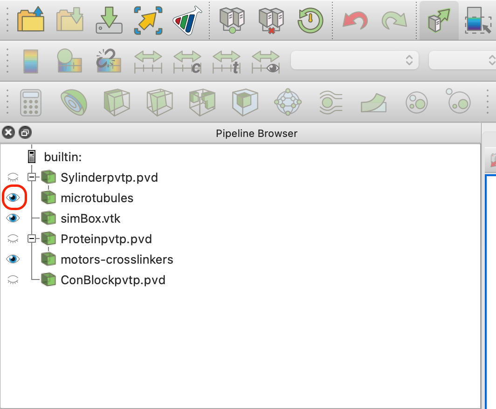
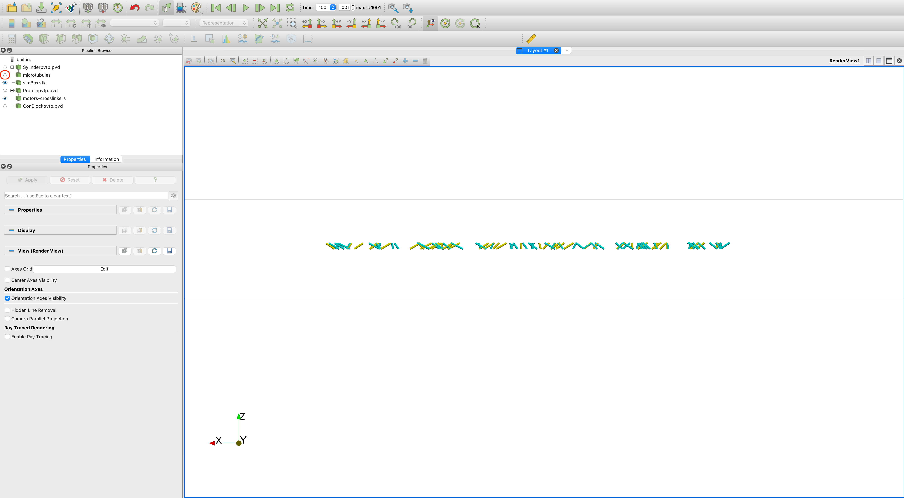
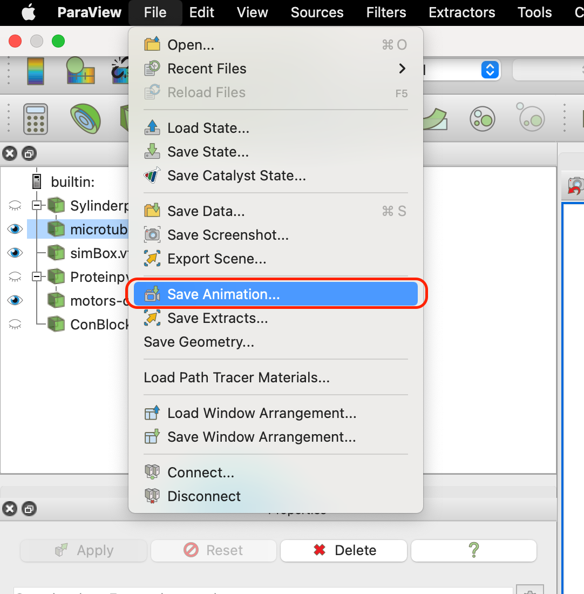
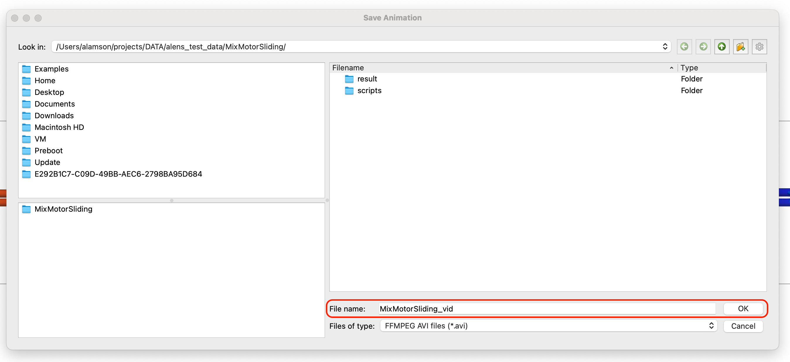
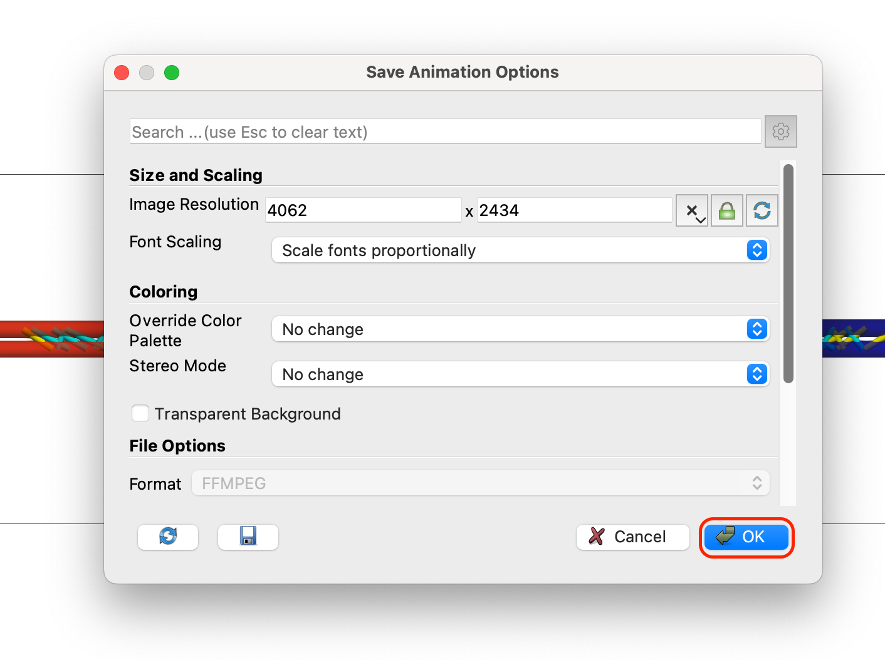

# Visualization
<!-- Created By: Adam Lamson -->
<!-- Last Edited: November 14, 2022 -->

## Overview of aLENS data files

aLENS produces 3 types of data files when run:
- `<Object>Ascii_<Snapshot#>.dat`: Contains positional, geometric, and state information of all \<Object\>s  at \<Snapshot#\>. These are in the same format as the initial data files like `TubuleInitial.dat` or `ProteinInitial.dat`. (See [initial file configurations](initial_files).)
<!-- (see [initial file configurations](./quickstart.md#initial-configuration-file-lines-optional)). -->

- `<Object>_r<Rank#>_<Snapshot#>.vtp`: XML vtk format in base64 binary encoding for all \<Object\> information. `aLENS.X` is written such that each MPI rank writes its own set of data to a unique `vtp` file marked by \<Rank#\>. These are not human readable but can be conveniently loaded into `Paraview` for visualization or read by VTK (either python or cpp) for data processing.

- `<Object>_<Snapshot#>.pvtp`: (pvtp = parallel vtp) An index to a set of `vtp` files (serial vtp), which holds the actual data. Therefore the number of `vtp` files in each `pvtp` file index is equal to the number of MPI ranks. The restriction is that the index `pvtp` file must appear in the same location as those `vtp` data files. For a comprehensive explanation of these `pvtp` files, read the official guide of vtk file format:  `https://kitware.github.io/vtk-examples/site/VTKFileFormats/#parallel-file-formats`

The data files are saved in different folders, but for postprocessing and visualization, files of a given sequence must appear in the same folder otherwise postprocessing or visualization programs may fail to load the entire sequence. The python script `Result2PVD.py` solves this restriction. More on this later in the tutorial. 
<!-- To run this script:
    
    ```bash
    $ cd ./result/
    $ python3 ./Result2PVD.py
    $ ls ./*.pvd
    ./ConBlockpvtp.pvd  ./Proteinpvtp.pvd  ./Sylinderpvtp.pvd
    ``` -->

## First visualization (using pre-made visualization file)
Visualizations are created and interacted with using paraview. Be sure to have this software installed [https://www.paraview.org/download/](https://www.paraview.org/download/) (This tutorial was made using ParaView-5.9.1). Tutorials for using paraview for general data visualization can be found on their [website](https://docs.paraview.org/en/latest/).
1. After running your [first simulation](quickstart), your `results` directory will have multiple result subdirectories inside of it.
    
    ```bash
    $ cd ~/Run/MixMotorSliding/result
    $ ls 
    Clean.sh  PNG  Result2PVD.py  compress.sh  result0-399  result400-799  result800-1199  simBox.vtk  uncompress.sh
    ```
    
    > NOTE: All generated data is held in the `result<FirstSnapshot#>-<LastSnapshot#>` directories. Data is divided among multiple directories to prevent too many files or too much data from being held in a single location, which can put unwanted stress on distributed files systems common among computing clusters. `<FirstSnapshot#>` specifies the earliest snapshot data held in that directory and `<LastSnapshot#>` the latest. The difference of these two numbers changes based on the number of objects in the simulation and number of MPI ranks used to run the simulation. Because of this, you can not change the number of ranks if you wish to restart a simulation using the builtin restart feature. 
    
2. To visualize the data, we must first run the `Result2PVD.py` script.
    
    ```bash
    $ python3 ./Result2PVD.py
    $ ls ./*.pvd
    ./ConBlockpvtp.pvd  ./Proteinpvtp.pvd  ./Sylinderpvtp.pvd
    ```
    
    This creates ParaView data (.pvd) files that point to the `.pvtp` files in the various result subfolders, allowing `Paraview` to load all the files belonging to a sequence in the correct order. It is safe to execute this script while `aLENS.X` is still running and writing data so analysis can occur before a simulation finishes.
    
3. Open up the paraview GUI.
    
    .png)
    
4. The quickest way to get interpretable visualizations is to load a pre-made ParaView state (.pvsm) file that has filters already applied to the data to be loaded. One has been provided in the MixMotorSliding example.
    - In the upper left hand corner, click `Files -> Load State`.
    
               
    
    - From the pop up window, navigate to the mounted Run directory on your local machine and click `MixMotorSliding.pvsm` and click OK.
        
        
        
5. In Load State Options choose ‘Search files under specified directory. Data Directory should populate with the correct run directory on your local machine. Select ‘Only Use Files In Data Directory’ and press OK.
    
           
    
6. Run visualization using run button at the top of the screen.
    
    
    
7. Objects in the simulation are shown on the left-hand bar and can be turned on and off by clicking on the eye icon next the the names. (The more objects shown, the slower the visualization will run)
    
           
    
    
    
8. To save a movie, one can either save each frame to a PNG file and then stitch them together using FFMPEG (script provided in `result/PNG/MovieGen.sh`) or generate an .avi file from ParaViews internal functionality. We will use the latter for now.

    - Click `File->Save Animation...`

               
        
    - Navigate to `MixMotorSliding` on your local if Save Animation window does not already bring your there and type in a name for your video file. Hit OK.
        
        
        
    - Options are available to control size, frame rate, resolution, etc. of file. Hit OK when done.
        
        

    You should now see a .avi file in your simulation directory.         

## Creating a your own ParaView state file (coming soon)